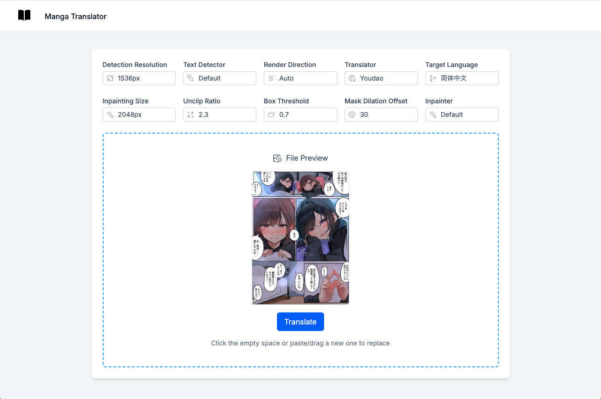

[ENGLISH](README.md)
## 特性

- 🚀 服务器端渲染
- ⚡️ 热模块替换 (HMR)
- 📦 资源打包和优化
- 🔄 数据加载和变更
- 🔒 默认使用 TypeScript
- 🎉 使用 TailwindCSS 进行样式设计
- 📖 [React Router 文档](https://reactrouter.com/)

## 开始使用

### 安装

安装依赖：

```bash
npm install
```

### 开发

在 `http://127.0.0.1:8000/` 准备 Fast API 服务器
参照此仓库：

https://github.com/zyddnys/manga-image-translator

启动带有热模块替换的开发服务器：

```bash
npm run dev
```

您的应用将在 `http://localhost:6868` 可用。

## 生产环境构建

创建生产环境构建：

```bash
npm run build
```

## 图片展示




## 后端代码

https://github.com/zyddnys/manga-image-translator
